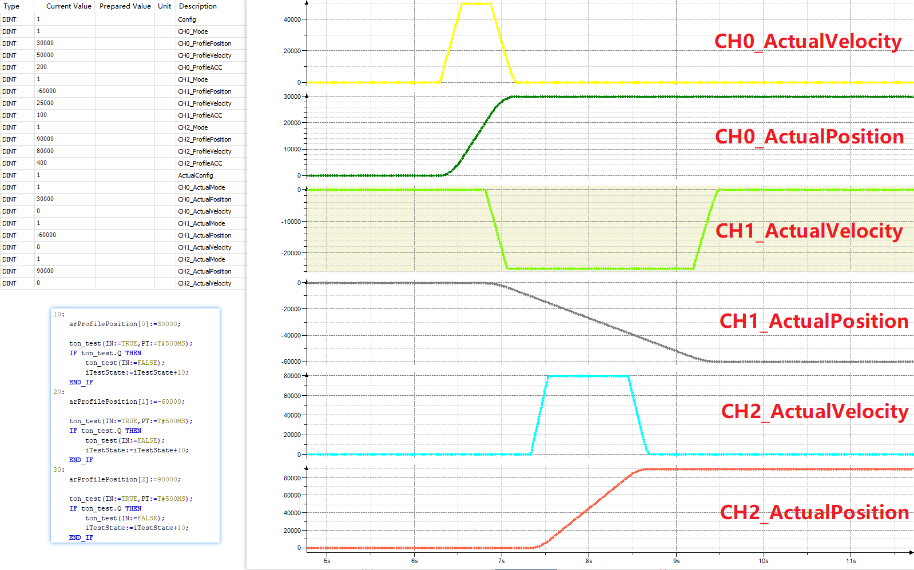

# XMC4300_Motor_Controller
 3 Axis Pulse Controller based on [XMC4300_EtherCAT_CoreBoard](https://github.com/feecat/XMC4300_EtherCAT_CoreBoard)  
   
 

----------

## Why  
We have so many step motor driver / servo driver, its no need to create a new one, just convert it to ethercat and use. Its simple.  
This is not CiA402 standand repositories, but similar. honestly, I dont know how to create cia402 profile so i just make it like IO devices.  
I have already test it with cheap step driver, I hope you can got more driver to test it.  

## How to use  
Connect with Driver by 4 wire: ENA, PWM, DIR, GND.  
Set ProfilePosition( CHx_Mode = 1) or ProfileVelocity( CHx_Mode = 3) in EtherCAT Master:  
In ProfilePosition Mode, Set the CHx_ProfilePosition, CHx_ProfileVelocity, CHx_ProfileACC, Then it will output pulse and automaticly stop at profile position.  
In ProfileVelocity Mode, Set the CHx_ProfileVelocity, CHx_ProfileACC, Then it will output pulse continually.  

PINOUT:  
| # | PINOUT | # |
| --- |---| :---: |
|CONFIG|ENA|P0.0|
|Channel 0| PWM| P2.2|
||DIR|P1.5|
|Channel 1| PWM| P2.3|
||DIR|P3.5|
|Channel 2| PWM| P2.4|
||DIR|P5.0|

The Enable is Config.0, its just connect to P0.0, not global enable signal.  
The SmoothTime is Config.16~Config.31, Smooth Enable is Config.2, Im not sure...  

## Prices  
Normally we can got a ethercat step driver by 600 rmb. But we can got a pulse step driver by 100 rmb.  
In servo driver its take more cost in ethercat protocol.  
So just use this controller to control pulse driver at simple use.  

## Hardware  
There need XMC4300_EtherCAT_CoreBoard and XMC4300_Motor_Controller, And one or more step motor driver.  
More information is in construction. Please see here later.  

